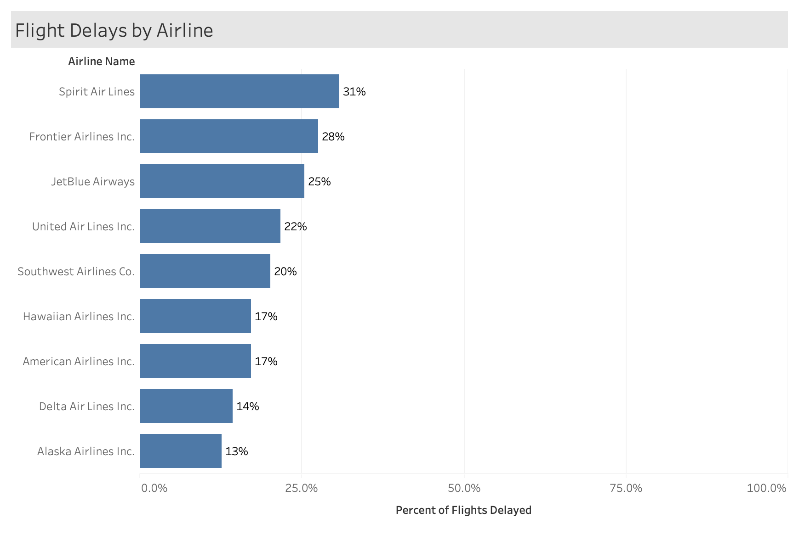
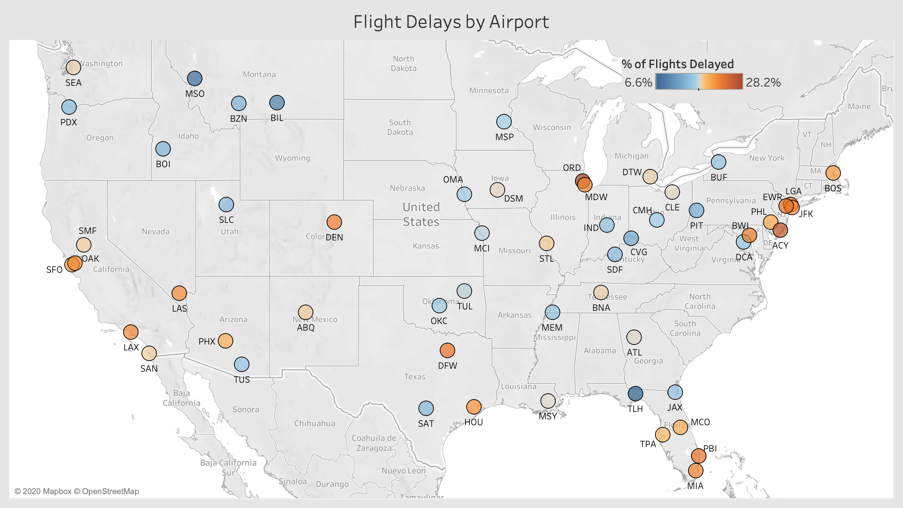

# Metis Project3: FlightDelays

**Summary**: In this project, I attempted to predict flight delays on US flights.  While this could also be a regression problem, in predicting the *length* of the delay, I made it a binary classification problem.  I simply said that any delay whatsoever would be classified as a delay.  This turned out to be about 20% of flights in the aggregate.

I ran a few different classification models, the most accurate turned out to be XG Boost, with an AUC score of 0.77.  It had an F1 score of 48% for actual delayed flights, and an F1 score of 85% for non-delayed flights.

I also built a web app that anybody can use to see the chances of their flight being delayed, as well as visual statistics about what went into that prediction.  Try it out [here](https://flightdelayhibbard.herokuapp.com/)!

## Data

I used 4 data sources for this project:

1. All 2015 US flights from [Kaggle](https://www.kaggle.com/usdot/flight-delays).  Features include:

- Time stamp of the flight
- Airline
- Originating and Departing airports
- Delay metrics

2. Weather data from the [NOAA](https://www.ncdc.noaa.gov/cdo-web/).  Features that affected delays: 

- Snow
- Rain
- Temperature
- Wind

3. Aircraft-specific data from [Airfleets](https://www.ncdc.noaa.gov/cdo-web/)

- Tail number
- Aircraft manufacturer and model
- Engines
- Date of first flight

4. Real-time flight data from [FlightAware API](https://flightaware.com/commercial/flightxml/)

- This data source allowed me to obtain the same features as above, but in real time, which enabled the Streamlit web app.

## Feature Engineering

There were many categorical features in my data set with high numbers of unique values.  Therefore I performed a lot of feature engineering to get accurate predictions.  The first few below are in order of usefulness, but not necessarily after that point.

- Previous Delay: was the previous flight of the same aircraft delayed?
    - 46% of all flights where the same aircraft was delayed earlier in the day are also delayed
- Snow (not engineered)
- Rain (not engineered)
- % of flights delayed for each airline
- % of flights delayed for each airport
- % of flights delayed for each aircraft model
- % of flights delayed for each month
- % of flights delayed for each hour of day
- % of flights delayed for each day of the week

A few of the results I imagine you want to see are below.  For more check out the Tableau workbook or Streamlit app.

## Predictive Modeling

I tested the following classification models and received the following scores.

| Model | AUC Score | F1 (Delays) | F1 (Non-Delays) | 
| ------| ----------| ------------|-----------------|
Logistic Regression | 0.74 | 0.43 | 0.86 | 
Random Forest | 0.76 | 0.49 | 0.85 | 
Gaussian Naive Bayes | 0.71 | 0.40 | 0.86 |
**XG Boost** | 0.76 | 0.48 | 0.85 | 
K Nearest Neighbors | N/A - too slow | 

As you can see XG Boost and Random Forest tied for the best model with a 0.76 AUC, but since XG Boost was much faster it is the winner.

Because correlations between model predictions were low (~0.5) I also tried out a Voting Classifier, but the slight benefit was not worth the extra time to run the model.

